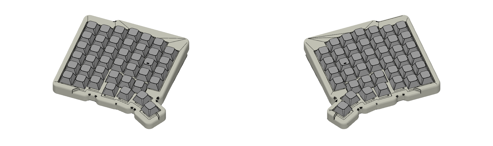
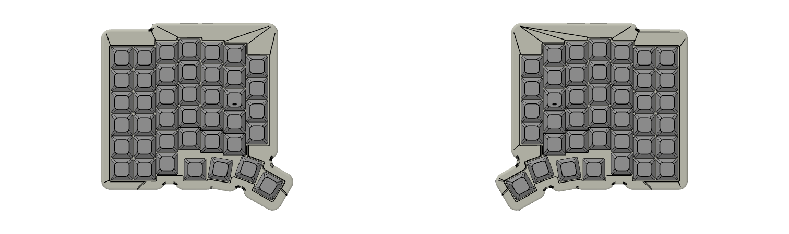

# split82key

Generated by [Auto-Keyboard-Design-Kit](https://auto-kdk.pages.dev/)

## Preview

- 3D View

- Top View

## Parts List

|Part|Quantity|
|---|---|
|wired controller|2|
|Conthrough(2.5mm, 11pin)|4|
|USB-C cable|2|
|MX switch and MX socket|76|
|Choc V2 switch and Choc socket|6|
|Diode|82|
|Keycap|82|

